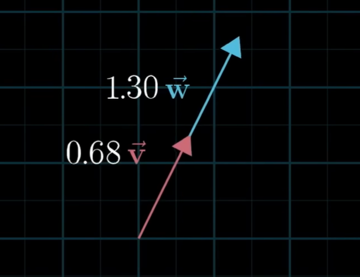
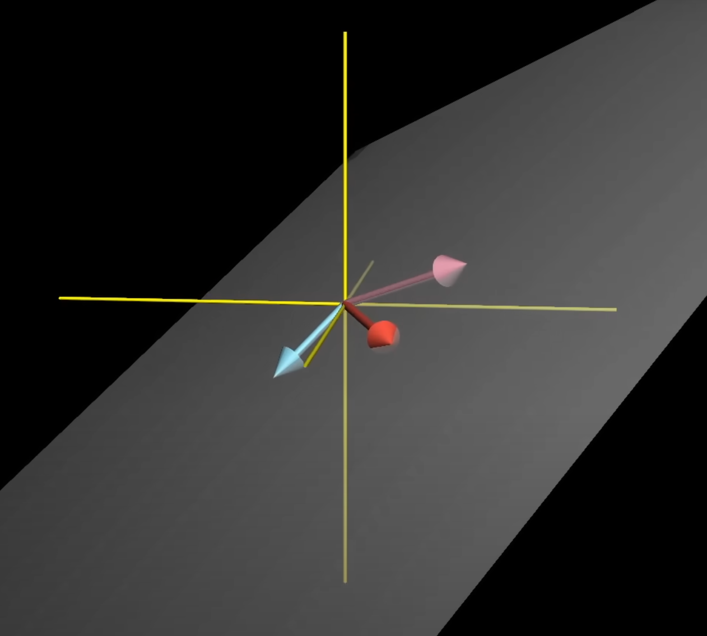

# Linear Algebra

## Vector 

### definition

- physics: an arrow in space with **length (magnitude)** and **direction**, its position doesn't matter - only how it points
- CS: an ordered list of numbers
- math: an object that obeys certain rules
    - adding two vectors, and the result is still a vector
    - multiplying a vector by a scaler (number)

-> unifying view: an arrow rooted at the origin in a coordinate system

### operations on vectors

1. addition: A(1, 2) + B(3, 4) = C(4, 6)

- think of each vector as a movement
- starting at the origin -> moving along A -> move in the direction and distance described by B
- the total movement is equivalent to moving along C (sum A + B)

2. scaler multiplication: 2 . D(1, 2) = E(2, 4)

- scale the vector by stretching or shrinking it
- keep direction or reverse it

### linear combination

1. linear combination

- scaling n vectors -> adding them -> a **linear combination** of those vector
- example: a v1 + b v2

2. span

- the set of all linear combinations of a set of vectors
- geometrically in xy space:
    - 2 vectors doesn't align -> span a plane
    - aligned vectors -> span a line
    - zero vectors -> span just the origin

3. linear dependent

- a set of vectors is linearly dependent if one can be written as a linear combination of the others
- remove a vector + not reduce the span -> redundant
- no vector in a set is redundant -> the vectors are linearly independent

    
    

### basic vectors

- a **basis** is a minimal set of linearly independent vectors that **span** the space
- unit vector in the xy coordinate system: i(1, 0), j(0, 1) -> basic vectors: i & j
- change the basic -> create new coordinate systems (basis transformation)

### vector space

a vector space is a collection of vectors that:
- can be added and scaled
- contain the zero vector
- follow 8 vector space properties
    - associativity: u + (v + w) = (u + v) + w
    - commutativity: u + v = v + u
    - identity element of addition: v + 0 = v
    - inverse element: v + (-v) = 0
    - compatibility of scalar mul: a(bv) = (ab)v
    - identity element of scalar mul: 1v = v
    - distributivity wrt vector add: a(u + v) = au + av
    - distributivity wrt field add: (a + b)v = av + bv

## Matrices

### linear transformation

- transformation -> function -> take in inputs and generate outputs
    - input: vector -> output: vector
    - transformation -> movement: input moving to output
- linear
    - all lines must remain line and evenly spaced without getting curved
    - origin remains fixed

### grid deformation

every transformation
- move the grid lines
- bend or straighten the shape of squares
- change the area, orientation, and angles

### matrices

- every matrix represents a linear transformation from one space to another one
- matrix completely defines its transformation by what it does to the basic vectors

### matrix multiplication = composing transformation

- rotate + stretch -> multiple those 2 matrices -> the result is a new matrix that represents the combined transformation
- **order matter**: (rotate -> stretch) != (stretch -> rotate)

### determinant

- the determinant of a 2x2 matrix is 3 -> the transformation triples the area
- it's 0 -> the space is flattened
- it's 0 -> not invertible
