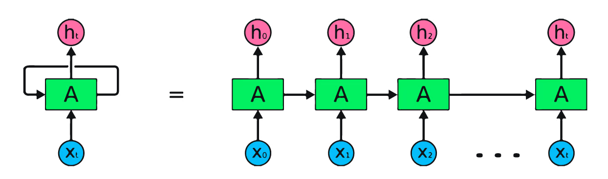
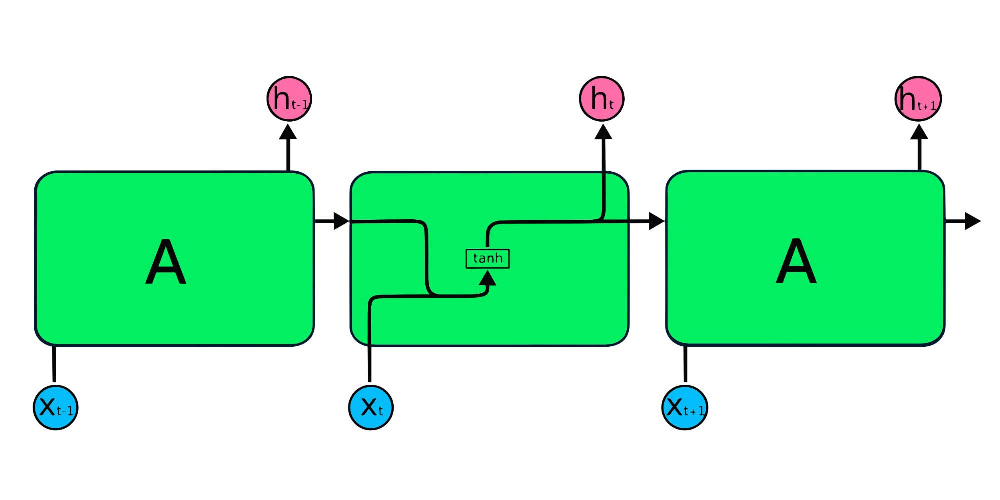
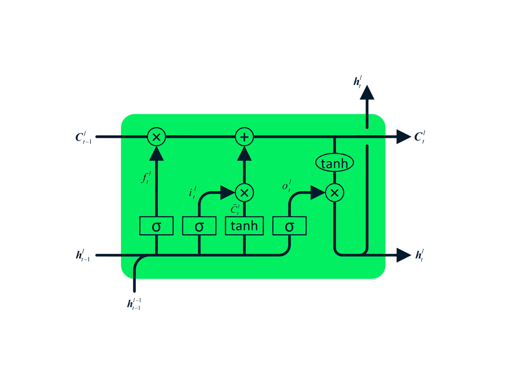
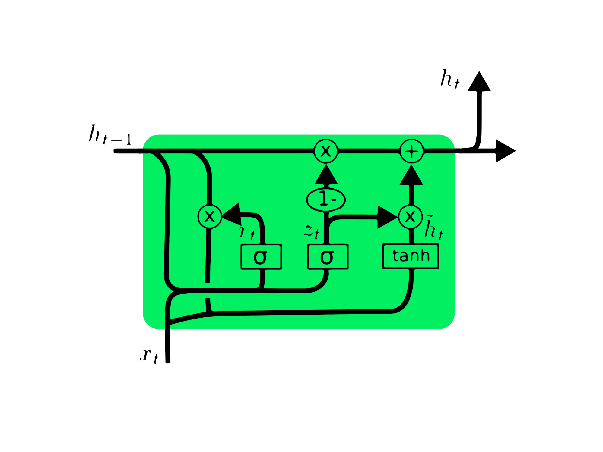

# facts

1. machine doesn't understand characters, words, or sentences
2. machines can only process numbers
3. text data must be encoded as numbers of input or output for any machine

-> text encoding: a process to convert meaning text into number/vector representation so as to preserver the context and relationship between words and sentences

## terminology

- document corpus: the whole set of text we have, basically our text corpus, can be anything like new articales, blogs, etc
- data corpus: the collection of **unique** words in our document corpus

# Index-Based Encoding

maps each unique word to a numerical identifier (index)

## how

1. create vocabulary dictionary: {'the': 0, 'cat': 1, 'sat': 2, 'on': 3, 'mat': 4}
2. replace word with indices: "the cat sat" -> [0,1,2]

# Bag of Words (BOW)

a text vectorization method that represents documents as vectors based on word frequency, ignoring word order and grammar

## how

1. create vocabulary from all unique words in the corpus
2. each document becomes a vector where each position corresponds to a word
3. vector values are word counts (or frequencies) in that document

# Word to vec

Word2Vec learns dense vector representations of words that capture semantic relationships through neural networking training

## 2 architectures

- CBOW (Continuous Bag of Words): predicts the current word based on its surrounding context words. it takes context words as input and tries to predict the target word -> efficient with frequent words
- skip-gram: predicts the context words given a target word -> effective for infrequent words and captures the semantic relationships between words by learning from the distributional patterns in a large corpus

## features

- dense vectors (typically 100-300 dimensions)
- semantic similarity: similar words have near vectors
- arithmetic relationships: king - man + woman = queen
- cosine similarity: measures word relatedness

## training process

- use shallow neural network with large corpus

# TFIDF

weights words based on their frequency in a document relative to their frequency across all documents

## formula

TF-IDF = TF x IDF

- TF (term frequency): how often word appears in document -> high TF = important to this document
    - TF = (word count in doc) / (total words in doc)
- IDF (Inverse Document Frequency): how rare word is across corpus -> high IDF = rare/distinctive word
    - IDF = log(total documents / documents containing word)

## use cases

information retrieval, document similarity, feature extraction for classification

# RNN

recurrent neural networks (RNNs) process sequential data by maintaining hidden state that carries information from previous time steps

## mechanism

unlike feedforward networks, RNNs have memory. at each time step:
- input: current element + hidden state from previous step
- output: prediction + updated hidden state for next step
- hidden state: carries information across sequence
- same weights applied at each time step

## forward pass

$$
\begin{aligned}
    & h_t = activation(W_{hh} \times h_{t-1} + W_{hx} \times x_t + b) \\
    & y_t = W_{hy} \times h_t + b_y 
\end{aligned}
$$
- $h_t$: hidden state
- $x_t$: input
- $y_t$: output at time t
- $W_{hh}$, $W_{hx}$ and $W_{hy}$: weight matrices

## features

- sequential processing: handler variable-length sequences
- memory: hidden state remembers previous inputs
- parameter sharing: same weights for all time steps
- temporal patterns: can learn dependencies over time

## problems

- vanishing gradients: difficulty learning long-term dependencies
- sequential processing: can't parallelize like CNNs

# LSTM

solve RNN's vanishing gradient problem through gating mechanisms that control information flow -> the cell is different

## architecture

3 gates:
- forget gate: decides what to remove from cell state -> removes irrelevant information
- input gate: decides what new information to store -> selectively updates cell state with new info
- output gate: controls what parts of cell state to output -> filters cell state to produce hidden state

cell state: separate memory stream that flows through network with minimal interference, allowing long-term information retention

# GRU

## architecture

2 gates:
- reset gate: controls how much past information to forget
- update gate: decides how much new information to accept

single state: combines cell state and hidden state into one, making it computationally more efficient

## key differences

- LSTM: more complex, separate cell/hidden states, potentially better for long sequences
- GRU: simpler, fewer parameters, faster training, often comparable performance
