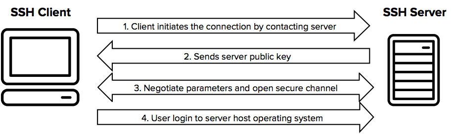

# repository

- a repository (*repo*) is a storage location that contains software packages, along with metadata describing them
- a **package manager** is a software tool that simplifies installing, updating, configuring and removing software packages on a system, utilizing repositories

## key points

1. contents
- precompiled packages (e.g `.deb` for Debian/Ubuntu, `.rpm` for Fedora/CentOS)
- source code
- metadata (dependencies, version numbers, descriptions)

2. purpose
- provides a central place to install, update, and remove software
- ensures software is compatible with Linux distribution
- handles dependencies automatically

3. types of repositories
- official repositories
- third-party repositories
- community repositories

4. how it works
- package manager (like `apt`, `dnf`, `yum`, or `pacman`) has a list of repositories (URLs or server addresses) in config files
- when run:

    ```bash
    sudo apt update
    sudo apt install vim
    ```

    the package manger:
    1. checks the repo list for the latest package metadata
    2. downloads the required package(s) and dependencies
    3. installs them on the system

## PPA (personal package archive)

a kind of mini-repository that individuals or teams can host for ubuntu (an extra part in the "app store" that isn't part of the official shelves, but someone made to share their own packages)

key points:
1. purpose
- let developers distribute software directly Ubuntu users without waiting for it to enter the official repositories
- often used for newer versions of software than what Ubuntu officially provides

2. how to use one
- add a PPA to the system, update package lists, then install the software
   ```bash
    sudo add-apt-repository ppa:author/ppa-name
    sudo apt update
    sudo apt install package-name
   ```

3. risks
- not official vetted by Ubuntu -> trust depends on the PPA maintainer
- could break compatibility if it replaces core packages

# SSH (Secure Shell)

- a network protocol (and a program) used to securely connect to and manage remote computers over an insecure network like the internet
- all user authentication, commands, output, and file transfers are encrypted to protect against attacks in the network



## main uses

1. remote login - control a remote Linux server
    ```bash
    ssh username@server_address
    ```

2. file transfer - via `scp` or `sftp` (secure versions of `cp` and `ftp`)
3. port forwarding & tunneling - secure data transfer between networks
4. automation - scripts can run commands remotely using SSH

## how it works

- encryption: all data (including the password) is encrypted so not one can know it
- authentication: prove a identity via
    - password
    - SSH key pair (more secure)
- default port: 22 (can be changed for security)

examples
```bash
ssh -i ~/.ssh/id_rsa foo@192.168.1.50 -p 8080
```
- `foo` -> username on the remote system
- `192.168.1.50` -> IP or domain of the remote machine
- `-p 8080` -> port 8080
- `-i ~/.ssh/id_rsa` -> key path (optional)

## SSH key authentication

1. generate a key pair: `$ ssh-keygen` -> creates a private key `~/.ssh/id_rsa` and a public key `~/.ssh/id_rsa.pub`
2. copy your public key to the remote server `$ ssh-copy-id foo@192.168.1.50`
3. now can log in without a password with `$ssh foo@192.168.1.50`

### additional

each machine can have many SSH keys

an SSH key is a file pair (private + public), and you can generate many of those for different purposes

1. generate a new key with a custom name
```bash
ssh-keygen -t ed25519 -f ~/.ssh/id_ed25519_new -C "your_email@example.com"
```
- `-t ed25519` -> key type
- `-f ~/.ssh/id_ed25519_new` -> save with a different filename
- `-C` -> a comment to help identify the key

2. add the new public key to the remote sever
```bash
ssh-copy-id -i ~/.ssh/id_ed25519_new user@server
```

3. use when connecting
```bash
ssh -i ~/.ssh/id_ed25519_new user@server
```